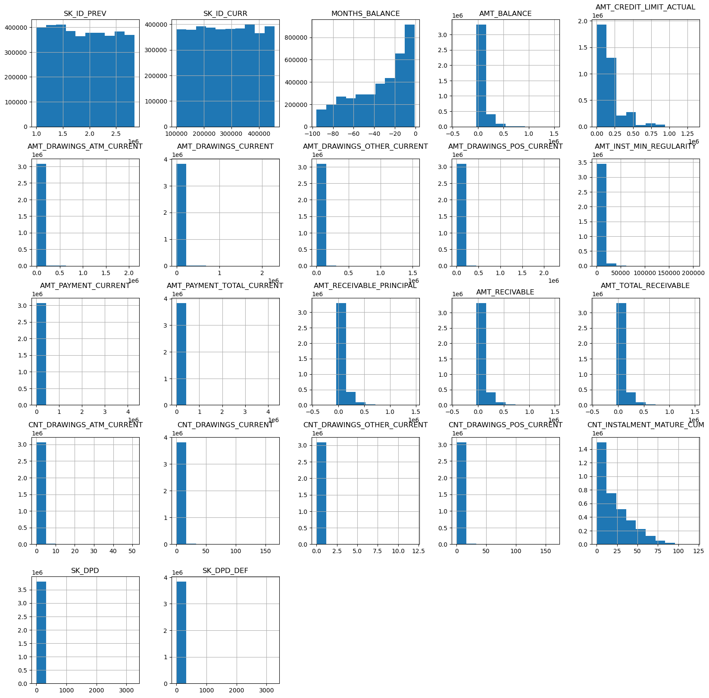
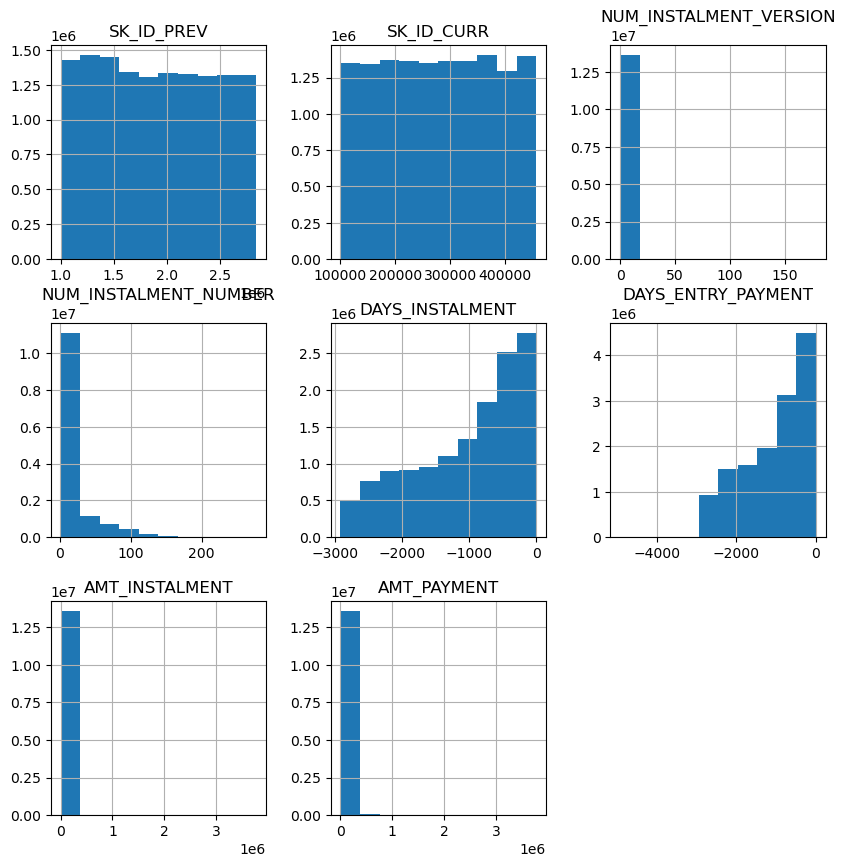
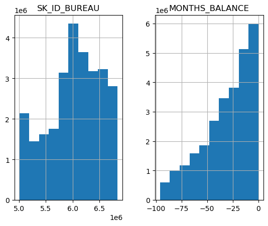
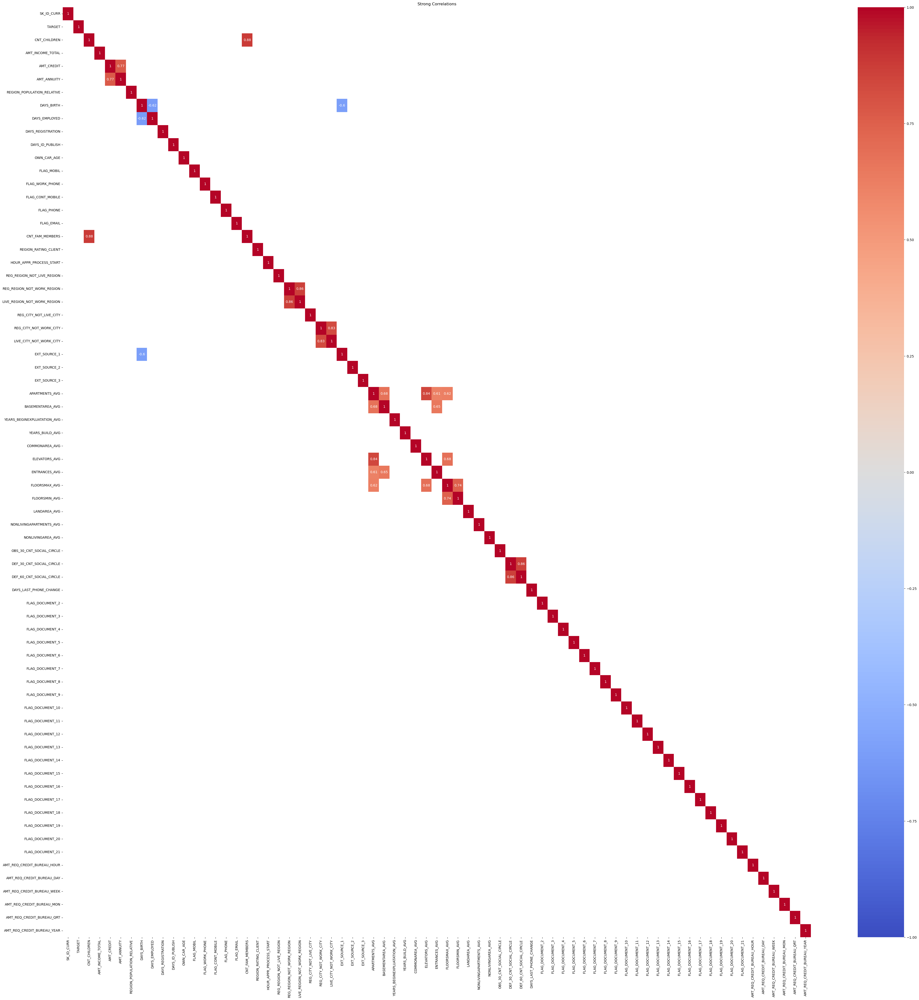
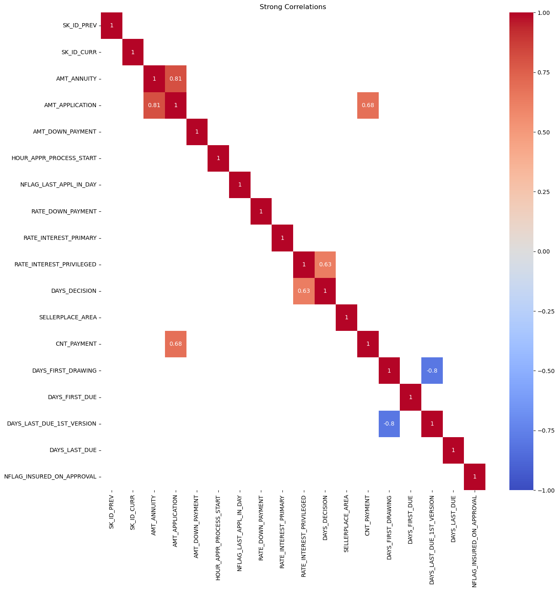
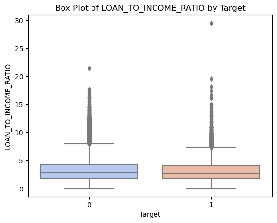

# Predicting the Capability of an Applicant to RePay a Loan

## Introduction:
### 1. Project Overview:
This project aims to predict whether a client can repay their loan by analyzing datasets provided through Kaggle. The submission format includes two columns: the client ID, labeled as "SK_ID_CURR", and the prediction outcome, labeled as "TARGET". The evaluation metric is the area under the ROC curve (AUC) calculated between the predicted probabilities and the observed target values. The primary goal is to achieve an AUC score of 0.70 or higher.

### 2. DataSet Description:
The datasets consist of main tables, all sharing common features, with the exception that the training dataset includes the TARGET variable while the test dataset does not. Below is a summary of the datasets:
1.
    - application_train: Contains 121 features (including the "TARGET" variable). Observations: 307511
    - application_test: Contains 120 features. Observations: 48744
The other following tables are:
2. bureau:
    - Details clients' previous credits provided by other financial institutions.
    - Includes ID columns "SK_ID_CURR" and "SK_ID_BUREAU," along with 15 features.
    - Observations: 1716428
3. bureau_balance: 
    - Monthly balance information for previous credits in the credit bureau.
    - Includes features "MONTHS_BALANCE" and "STATUS," with ID column "SK_ID_BUREAU."
    - Observations: 27299925
4. POS_CASH_balance
    - Monthly balance snapshots of cash loans and prior point-of-sale transactions with Home Credit.
    - Includes ID columns "SK_ID_CURR" and "SK_ID_PREV," along with 6 additional features.
    - Observations: 10001358
5. credit_card_balance
    - Monthly balance snapshots for previous credit cards with Home Credit.
    - Includes 21 features and the same ID structure as POS_CASH_balance.
    - Observations: 3840312
6. previous_application
    - Information about clients' previous Home Credit loan applications.
    - Includes 35 features with IDs similar to those in POS_CASH_balance and credit_card_balance.
    - Observations: 1670214
7. installments_payments
    - History of repayments for previous credits related to Home Credit loans.
    - Includes 8 features and ID columns "SK_ID_CURR" and "SK_ID_PREV."
    - Observations: 13605401 


## Exploratory Analysis (EDA):

### 1. Data Overview: 
Each dataset undergoes a detailed exploratory analysis, including steps such as an overview of the data, missing values analysis, and feature correlation analysis. The results of these analyses are documented in the [EDA Notebook](HomeCredit_EDA_class.ipynb) for individual tables.

1. application_train/application_test:


3. POS_CASH_balance.:


4. bureau:


5. credit_card_balance:


6. previous_applications:


7. installment_payments:


8. bureau_balance: 


These visualizations help determine which features to retain, drop, or engineer. Additional insights are obtained through a thorough analysis of missing values and examination of feature correlations within each table. These steps inform decisions regarding feature selection and engineering.


### 2. Missing Values Analysis:
Details on how missing values are handled can be found in this Python file: [View the Python Script](preprocessed_DataClass.py)

During the EDA process, columns with more than 50% missing data are identified and considered for removal. This approach is applied systematically to each dataset, ensuring data quality for subsequent analysis.

Based on the analysis of each table, the following columns were identified for removal due to high levels of missing values:

    1. application_train/test: Columns with more than half nulls: ['OWN_CAR_AGE', 'EXT_SOURCE_1', 'APARTMENTS_AVG', 'BASEMENTAREA_AVG', 'YEARS_BUILD_AVG', 'COMMONAREA_AVG', 'ELEVATORS_AVG', 'ENTRANCES_AVG', 'FLOORSMIN_AVG', 'LANDAREA_AVG', 'LIVINGAPARTMENTS_AVG', 'LIVINGAREA_AVG', 'NONLIVINGAPARTMENTS_AVG', 'NONLIVINGAREA_AVG', 'APARTMENTS_MODE', 'BASEMENTAREA_MODE', 'YEARS_BUILD_MODE', 'COMMONAREA_MODE', 'ELEVATORS_MODE', 'ENTRANCES_MODE', 'FLOORSMIN_MODE', 'LANDAREA_MODE', 'LIVINGAPARTMENTS_MODE', 'LIVINGAREA_MODE', 'NONLIVINGAPARTMENTS_MODE', 'NONLIVINGAREA_MODE', 'APARTMENTS_MEDI', 'BASEMENTAREA_MEDI', 'YEARS_BUILD_MEDI', 'COMMONAREA_MEDI', 'ELEVATORS_MEDI', 'ENTRANCES_MEDI', 'FLOORSMIN_MEDI', 'LANDAREA_MEDI', 'LIVINGAPARTMENTS_MEDI', 'LIVINGAREA_MEDI', 'NONLIVINGAPARTMENTS_MEDI', 'NONLIVINGAREA_MEDI', 'FONDKAPREMONT_MODE', 'HOUSETYPE_MODE', 'WALLSMATERIAL_MODE']

    2. POS_CASH_balance: This table does not have ant features that are missing values of more than half of there entries.

    3. bureau: Columns with more than half nulls: ['AMT_CREDIT_MAX_OVERDUE', 'AMT_ANNUITY']

    4. credit_card_balance: This table does not have ant features that are missing values of more than half of there entries.

    5. previous_applications: Columns with more than half nulls: ['AMT_DOWN_PAYMENT', 'RATE_DOWN_PAYMENT', 'RATE_INTEREST_PRIMARY', 'RATE_INTEREST_PRIVILEGED']

    6. installment_payments: This table does not have ant features that are missing values of more than half of there entries.

    7. bureau_balance: This table does not have ant features that are missing values of more than half of there entries.


### 3. Target Variable Analysis:
The image below illustrates the distribution of the target variable, showing the number of observations in class 0 and class 1. It is evident that the dataset is highly imbalanced. To address this, XGBoost is a suitable choice for modeling, as it is known to be robust to class imbalances and effectively handles skewed data distributions without requiring significant modifications, unlike neural networks.


count    307511.000000
mean          0.080729
std           0.272419
min           0.000000
25%           0.000000
50%           0.000000
75%           0.000000
max           1.000000
Name: TARGET, dtype: float64


### 4. Feature Correlation + What features are kept:

Before examining the top correlated features, it is important to note that a very high correlation between two features might not be ideal, especially if they are the only features with such high correlation values. This can lead to multicollinearity, which negatively impacts model performance. However, a high correlation with the target variable is generally desirable, as it indicates that the feature is predictive of the target. The features dropped due to high correlation values are as follows:

    1. application_train/test- ['AMT_GOODS_PRICE', 'FLAG_EMP_PHONE', 'REGION_RATING_CLIENT_W_CITY', 'LIVINGAPARTMENTS_AVG', 'LIVINGAREA_AVG', 'APARTMENTS_MODE', 'BASEMENTAREA_MODE',
 'YEARS_BEGINEXPLUATATION_MODE', 'YEARS_BUILD_MODE', 'COMMONAREA_MODE', 'ELEVATORS_MODE', 'ENTRANCES_MODE', 'FLOORSMAX_MODE', 'FLOORSMIN_MODE', 'LANDAREA_MODE', 'LIVINGAPARTMENTS_MODE', 'LIVINGAREA_MODE', 'NONLIVINGAPARTMENTS_MODE', 'NONLIVINGAREA_MODE', 'APARTMENTS_MEDI','BASEMENTAREA_MEDI', 'YEARS_BEGINEXPLUATATION_MEDI', 'YEARS_BUILD_MEDI' 'COMMONAREA_MEDI', 'ELEVATORS_MEDI', 'ENTRANCES_MEDI', 'FLOORSMAX_MEDI', 'FLOORSMIN_MEDI', 'LANDAREA_MEDI', 'LIVINGAPARTMENTS_MEDI', 'LIVINGAREA_MEDI', 'NONLIVINGAPARTMENTS_MEDI', 'NONLIVINGAREA_MEDI',
 'TOTALAREA_MODE', 'OBS_60_CNT_SOCIAL_CIRCLE']

    2. POS_CASH_balance- []

    3. bureau- []

    4. credit_card_balance- ['AMT_PAYMENT_TOTAL_CURRENT', 'AMT_RECEIVABLE_PRINCIPAL', 'AMT_RECIVABLE',
 'AMT_TOTAL_RECEIVABLE', 'CNT_DRAWINGS_POS_CURRENT']

    5. previous_applications- ['AMT_CREDIT', 'AMT_GOODS_PRICE', 'DAYS_TERMINATION']

    6. installment_payments- ['DAYS_ENTRY_PAYMENT', 'AMT_PAYMENT']

    7. bureau_balance- [] 

The figures below show correlation matrices for the features with strong correlations, using a threshold of 0.6 and an upper limit of 0.9. These figures display the top correlations within each table. The features were filtered to prevent kernel crashes when merging all tables into training and test datasets. This step is necessary to limit the size of the datasets while retaining the most predictive features.

    1. application_train/test:


    2. POS_CASH_balance:


    3. bureau:


    4. credit_card_balance:


    5. previous_applications:


Although the installments_payments and bureau_balance tables do not contain features that are highly correlated with the target variable, their aggregated information can still be valuable. These tables summarize financial behavior, such as historical repayment performance and external credit history, which are crucial for predicting default risk.

Even if individual features from these tables do not show strong correlations with the target, their combined impact can provide unique predictive value. Before deciding to exclude them, it is essential to assess their contribution to the model using feature importance metrics, correlations with the target, or validation of the model's performance with and without these features.

Based on these factors, I decided to retain the following features:

    1. application_train/test: ['EXT_SOURCE_3', 'NAME_FAMILY_STATUS', 'AMT_INCOME_TOTAL',   'NAME_INCOME_TYPE', 'AMT_CREDIT', 'NAME_CONTRACT_TYPE', 'OCCUPATION_TYPE', 'SK_ID_CURR', 'ORGANIZATION_TYPE', 'NAME_HOUSING_TYPE', 'DAYS_EMPLOYED' 'EXT_SOURCE_2', 'TARGET', 'DAYS_BIRTH', 'NAME_EDUCATION_TYPE', 'AMT_ANNUITY'. ] Althought the test doesn't have 'TARGET'.

    2. POS_CASH_balance: ['SK_ID_CURR', 'MONTHS_BALANCE', 'CNT_INSTALMENT', 'CNT_INSTALMENT_FUTURE', 'SK_DPD_DEF', 'NAME_CONTRACT_STATUS']
        a. Merging tables I used this:
        POS_CASH_agg = POS_CASH_balance.groupby('SK_ID_CURR').agg({
        'MONTHS_BALANCE': ['mean', 'min', 'max'],  
        'CNT_INSTALMENT': ['mean', 'min', 'max'],  
        'CNT_INSTALMENT_FUTURE': ['mean', 'min', 'max'], 
        'SK_DPD_DEF': ['mean','max'],
        'NAME_CONTRACT_STATUS' : ['count'],
        'INSTALMENT_RATIO': ['mean', 'max'] 
        }).reset_index()

    3. bureau: ['SK_ID_CURR','SK_ID_BUREAU','CREDIT_ACTIVE', 'DAYS_CREDIT', 'DAYS_CREDIT_ENDDATE', 
                 'AMT_CREDIT_SUM','DAYS_CREDIT_UPDATE', 'CREDIT_DAY_OVERDUE', 'CREDIT_TYPE']
        a. Merging tables I used this:
        bureau_agg = bureau.groupby('SK_ID_CURR').agg({
        'DAYS_CREDIT': ['mean', 'min', 'max'],
        'DAYS_CREDIT_ENDDATE': ['mean'],
        'AMT_CREDIT_SUM': ['mean', 'max'],
        'DAYS_CREDIT_UPDATE': ['mean', 'max'],
        'CREDIT_DAY_OVERDUE': ['mean', 'max'],
        'CREDIT_TYPE': ['count'],
        'DEFAULT_RATE': 'mean'
        }).reset_index()
        
    4. credit_card_balance: ['SK_ID_CURR', 'AMT_BALANCE', 'AMT_PAYMENT_CURRENT','CNT_DRAWINGS_ATM_CURRENT', 'NAME_CONTRACT_STATUS', 'SK_DPD','AMT_INST_MIN_REGULARITY', 'SK_DPD_DEF']
        a. Merging tables I used this:
        credit_card_agg = credit_card_balance.groupby('SK_ID_CURR').agg({
        'CNT_DRAWINGS_ATM_CURRENT': ['mean', 'max'],           
        'AMT_BALANCE': ['mean', 'max'],                   
        'AMT_PAYMENT_CURRENT': ['mean', 'sum'],             
        'SK_DPD': ['mean', 'max'],
        'AMT_INST_MIN_REGULARITY': ['mean', 'min', 'max'],
        'SK_DPD_DEF': ['mean', 'max']                    
        }).reset_index()

    5. previous_application: ['SK_ID_CURR', 'AMT_APPLICATION', 'AMT_ANNUITY',  'NAME_CONTRACT_STATUS', 'DAYS_DECISION']
        a. Merging tables I used this:
        previous_application_agg = previous_application.groupby('SK_ID_CURR').agg({
        'AMT_APPLICATION': ['mean', 'max'],
        'AMT_ANNUITY': ['mean', 'max'],
        'NAME_CONTRACT_STATUS': ['count'],
        'DAYS_DECISION': ['mean', 'min']
        }).reset_index()

    6. installments_payments: ['SK_ID_CURR', 'AMT_INSTALMENT']
        a. Merging tables I used this:
        installments_agg = installments_payments.groupby('SK_ID_CURR').agg({
        'AMT_INSTALMENT': ['mean', 'sum', 'max'],
        }).reset_index()

    7. bureau_balance: ['SK_ID_BUREAU', ' MONTHS_BALANCE', 'STATUS']
        a. 
        bureau_balance_agg = bureau_balance.groupby('SK_ID_BUREAU').agg({
    'MONTHS_BALANCE': ['mean', 'min', 'max'],
    'STATUS': ['count']
}).reset_index()
        b Merging tables I used this:
        bureau_agg = bureau.groupby('SK_ID_CURR').agg({
        'MONTHS_BALANCE_mean': 'mean',  # mean of MONTHS_BALANCE_mean
        'MONTHS_BALANCE_max': 'max',    # max of MONTHS_BALANCE_mean
        'STATUS_count': 'sum'           
}).reset_index()
        
### 5. Key Observations:
This portion of the EDA will be included in the main modeling notebook, as it focuses on identifying features that can help determine which customers are likely to default on their loans. The first two features being compared are derived after feature engineering the merged tables, as these engineered features often provide better insights into loan repayment behavior. The two features analyzed here are DEBT_TO_INCOME_RATIO and LOAN_TO_INCOME_RATIO.

figure one: 
    

figure two: 
    

Figure 1 compares the LOAN_TO_INCOME_RATIO for the two target classes: TARGET = 0 (repaid loans) and TARGET = 1 (unrepaid loans or defaults). The medians for both classes are very similar (2.77 for TARGET = 0 and 2.75 for TARGET = 1), indicating that the loan-to-income ratio is not a strong distinguishing feature between the two groups. However, there are significant outliers, particularly in TARGET = 1, where the ratio can reach as high as 29.46. This suggests that extreme loan-to-income ratios are more common among those who default. Although the median values do not provide strong differentiation, the presence of these outliers indicates that the LOAN_TO_INCOME_RATIO retains some predictive value and should be included in the analysis.

Figure 2 examines the DEBT_TO_INCOME_RATIO for the same target classes. The medians are again close (3.27 for TARGET = 0 and 3.25 for TARGET = 1), reflecting a slight difference between the two groups. However, outliers in TARGET = 1, with values reaching up to 84.74, suggest that higher debt-to-income ratios are more prevalent among customers who defaulted. While the overall separation between the two groups is modest, the DEBT_TO_INCOME_RATIO appears to offer slightly better discrimination compared to the LOAN_TO_INCOME_RATIO. The presence of outliers in TARGET = 1 reinforces the notion that this feature may contribute valuable insights into loan repayment behavior.

## Data Preprocessing:
The preprocessing steps for this project are organized into sections within two main files: [Model_Notebook_NN](Home-Credit-NN.ipynb), and [Model_Notebook_XGB](Home-Credit-XGB-Main.ipynb). These steps are performed both on individual tables and on the merged dataset. The workflow of the preprocessing process is structured as follows:

1. Importing Necessary Libraries for data preprocessing and analysis
2. Loading the data for all tables including application_test
3. Processing Each Table Separately
    - Each table mentioned earlier is analyzed individually to determine which features to retain, feature-engineer, or discard. This step is based on their correlations with one another and the target variable. Feature engineering is performed both before and after merging the tables.
    - Null values in each table are addressed before proceeding with encoding, aggregations, and size reduction.

During the first part of Step 3, I decided which features to keep by referencing the [EDA_Notebook](HomeCredit_EDA_class.ipynb). This notebook is similarly organized into sections for each table, starting with the main table, application_train/test. When selecting features, I considered the percentage of missing values per table, with a threshold set to exclude features having more than 50% missing data.

For identifying columns to drop due to missing values, the following block of code was applied across all tables:
    ```python
            # Threshold for more than half nulls
            threshold = len(DataFrame) / 2

            # Find columns with more than half nulls
            columns_with_many_nulls = DataFrame.columns[DataFrame.isnull().sum() > threshold]

            print("Columns with more than half nulls:", columns_with_many_nulls.tolist())

This block of code was used for all tables to see which features to drop based on the null value.

For the second portion of Step 3, I referred to the EDA notebook to analyze feature correlations. Columns with very high correlations (threshold: ≥ 0.9) were removed to mitigate multicollinearity.

Each section of Step 3 provides detailed explanations regarding the features selected for retention and the applied feature engineering.

Specific details about handling null values, encoding, and reducing data size are documented in this file: [Preprocessed_data](preprocessed_DataClass.py). The file is organized into the following sections:
    - Import Libraries
    - Handling null values: Function handle_missing_values
    - Encoding:
        - Label Encoding:  Functions label_encode_train, and label_encode_test
        - Target Encoding:  Functions target_encode_train, and target_encode_test
    - Reducing the memory usage for the datasets:  Function red_mem_usage

For the encoding process, two functions are defined for each encoding strategy. The label_encode_train and target_encode_train functions save encoded columns in dictionary format, which is then used to transform the test dataset. The corresponding label_encode_test and target_encode_test functions retrieve these dictionaries to ensure consistency in encoding between the training and test datasets.


## Modeling:
Below are the top two models where the AUC score was prioritized. However, while the first model shows a high AUC score, its classification report is not ideal when compared to the second model. The classification reports for both the neural network and XGBoost models are quite similar, but I chose to proceed with XGBoost since it outperformed the neural network in terms of both the AUC score and the recall score for class 1, which was 3% higher.
1. Neural Networks:
    - Scores:
        - AUC = 0.73581
         - classification_report:
                                | Class        | Precision | Recall | F1-Score | Support |
                                |--------------|-----------|--------|----------|---------|
                                | 0            | 0.95      | 0.78   | 0.86     | 70672   |
                                | 1            | 0.19      | 0.57   | 0.28     | 6206    |
                                | Accuracy     |           |        | 0.77     | 76878   |
                                | Macro avg    | 0.57      | 0.68   | 0.57     | 76878   |
                                | Weighted avg | 0.89      | 0.77   | 0.81     | 76878   |
    - Paramterss:
        - Sequential Model: 3 Dense layers of 256, 128, 64, 32
        - 3 layers of BatchNormalization
        - 3 dropout layers: 0.4, 0.3, 0.2
        - Threshold = 0.1 (i.e: y_pred_prob > 0.1)

2. XGBOOST:
    - Scores:
        - AUC = 0.75748,  
        - classification_report:
                                | Class        | Precision | Recall | F1-Score | Support |
                                |--------------|-----------|--------|----------|---------|
                                | 0            | 0.96      | 0.78   | 0.86     | 70672   |
                                | 1            | 0.19      | 0.60   | 0.29     | 6206    |
                                | Accuracy     |           |        | 0.77     | 76878   |
                                | Macro avg    | 0.58      | 0.69   | 0.58     | 76878   |
                                | Weighted avg | 0.90      | 0.77   | 0.81     | 76878   |
    - Parameters:
        - 'learning_rate': [0.001, 0.01, 0.1],
        - 'n_estimators': [100, 200, 300],
        - 'max_depth': [3, 5, 7],
        - 'subsample': [0.6, 0.8, 1.0],
        - 'colsample_bytree': [0.6, 0.8, 1.0],
        - 'alpha': [0, 0.1, 1, 10],
        - 'lambda': [0, 1, 10, 100],
        - 'scale_pos_weight': [1, len(ytrain[ytrain == 0]) / len(ytrain[ytrain == 1]), 10, 20, 50],
        - 'min_child_weight': [1, 5, 10],
        - 'gamma': [0, 0.1, 1, 10]
        - Threshold = 0.1 (i.e: y_pred_prob > 0.1)
    
To determine the best threshold to use for comparison across both models, I employed a for-loop to evaluate each threshold from the list: 0.2, 0.1, 0.05, and 0.03. Although the highest recall for class 1 was achieved with a threshold of 0.03 for both models, I decided to use 0.1 as the threshold. This decision was based on the fact that 0.03 resulted in a significant number of incorrect positive predictions, as evidenced by the accuracy scores: 34% for the XGBoost model and 23% for the neural network. In contrast, a threshold of 0.1 provided higher accuracy for both models, leading to a better balance in their classification reports. For more detailed comparisons, please refer to the following notebooks:
    - [Model_Notebook_NN](Home-Credit-NN.ipynb)
    - [Model_Notebook_XGB](Home-Credit-XGB-Main.ipynb)

Regarding XGBoost, the parameter 'scale_pos_weight' was set to [1, len(ytrain[ytrain == 0]) / len(ytrain[ytrain == 1]), 10, 20, 50] was proved to be effective in addressing class imbalance, outperforming the neural network model in this regard.


## Conclusion: 
The primary goal of this project was to determine whether a customer can repay their loan, framing this as a classification problem. Given the large dataset, feature selection began with an assessment of null value counts—features with a high percentage of missing values were dropped. Next, I examined the correlations between features to identify and address redundancy. To prepare the data, categorical features were encoded, and feature engineering was performed to enhance predictive performance.

Two models were compared: neural networks and XGBoost. Based on the modeling results, XGBoost was selected as the preferred model. It proved to be more robust than the neural network, delivering slightly better performance in both the AUC score and the classification report. XGBoost also offered advantages in handling the imbalanced target variable, thanks to the use of the scale_pos_weight parameter and the chosen threshold of 0.1, which balanced accuracy and recall effectively.

The final Kaggle score for XGBoost was 0.75748, with a validation score of 0.76648. For the neural network, the final Kaggle score was 0.73581, and the validation score was 0.74761.

Achieving these scores required careful attention to handling null values, examining feature correlations, and applying logical reasoning to select the most relevant features in this large-scale dataset. The project included an [EDA Notebook](HomeCredit_EDA_class.ipynb) to explore null values, feature correlations, and target variable analysis.

This model has practical applications in determining whether a person should be approved for a loan by evaluating factors such as their credit score, income, and other financial metrics. By identifying high-risk applicants, financial institutions can make more informed decisions to minimize default risks. Additionally, the model could assist in tailoring loan terms, such as interest rates or repayment schedules, based on the applicant’s risk profile, ensuring that loans are more accessible to low-risk clients while maintaining profitability for lenders.


## References:
- https://medium.com/@abdallahashraf90x/all-you-need-to-know-about-correlation-for-machine-learning-e249fec292e9#:~:text=It%20is%20not%20enough%20to,little%20connection%20between%20the%20variables
- https://stackoverflow.com/questions/29294983/how-to-calculate-correlation-between-all-columns-and-remove-highly-correlated-on
- https://www.tensorflow.org/api_docs/python/tf/keras/layers
- https://www.tensorflow.org/api_docs/python/tf/keras/callbacks/LearningRateScheduler
- https://www.tensorflow.org/addons/tutorials/optimizers_cyclicallearningrate
- https://pytorch.org/docs/stable/generated/torch.optim.lr_scheduler.CyclicLR.html
- https://www.datacamp.com/tutorial/cyclical-learning-neural-nets
- https://www.kaggle.com/code/gemartin/load-data-reduce-memory-usage
- https://machinelearningmastery.com/roc-curves-and-precision-recall-curves-for-imbalanced-classification/ 


